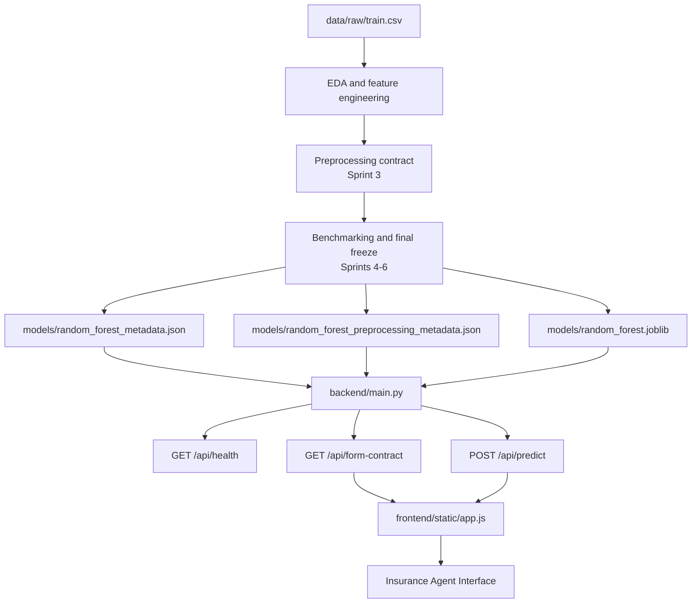

# AutoGuard AI Final Project Report

**Project:** AutoGuard AI  
**Subtitle:** Insurance Underwriting Assistant  
**Course scope:** End-to-end academic machine learning project with production-style inference interface  
**Final production model:** Random Forest (`sklearn.ensemble.RandomForestClassifier`)  
**Production artifact version:** `sprint_06_final_freeze_v1`

## 1. Executive Summary

AutoGuard AI addresses a practical underwriting problem: identifying vehicle
insurance applicants who are more likely to submit a claim, using structured
policyholder, vehicle, and portfolio-context data.

The project evolved from raw claim-classification data exploration into a
frozen preprocessing contract, a benchmarked modeling package, and a working
underwriting assistant interface. The final production package uses a Random
Forest model trained on the approved Sprint 3 dataset and served through a
FastAPI backend with a contract-driven HTML/CSS/JavaScript frontend.

On the untouched holdout set, the final frozen model achieved:

| Metric | Final holdout value |
|---|---:|
| Accuracy | `0.597861` |
| Precision | `0.098812` |
| Recall | `0.651246` |
| F1 | `0.171589` |
| ROC-AUC | `0.661994` |
| PR-AUC | `0.110902` |

The final outcome is a submission-ready project that combines academic ML
workflow discipline with a usable underwriting assistant interface.

## 2. Introduction

Insurance underwriting teams need early signals about which policies deserve
closer review. In practice, most customers will not file a claim, so the value
of a predictive system comes from identifying a relatively small higher-risk
minority without flooding operations with unnecessary manual review.

AutoGuard AI was designed as a decision-support system rather than an
automation engine. Its objectives were:

1. predict the probability that a customer will submit an insurance claim
2. translate that probability into practical underwriting guidance
3. compare multiple model families under a frozen preprocessing contract
4. expose the final model through a simple production-style interface

## 3. Dataset Description

The approved dataset source of truth is the local Kaggle-derived package:

- `data/raw/train.csv`
- `data/raw/test.csv`
- `data/raw/sample_submission.csv`

Key dataset statistics:

| Item | Value |
|---|---:|
| Training rows | `58,592` |
| Training columns | `44` |
| Official test rows | `39,063` |
| Official test columns | `43` |
| Target column | `is_claim` |
| Positive class count | `3,748` |
| Negative class count | `54,844` |
| Positive class rate | `6.3968%` |
| Missing values | `0` |
| Full duplicate rows | `0` |
| Train memory footprint | `~90.67 MiB` |

The table includes one identifier (`policy_id`), one binary target
(`is_claim`), mixed categorical and numerical vehicle/policy fields, and two
structured specification fields (`max_torque`, `max_power`) that required
parsing before modeling.

The class imbalance of roughly `14.63:1` made this an appropriate but
non-trivial dataset for academic supervised learning.

## 4. Data Understanding & EDA

Sprint 1 established that the dataset is clean enough for modeling and
business-relevant enough for underwriting experimentation.

Main EDA findings:

- `policy_tenure` showed the clearest raw univariate relationship with claim
  risk
- `population_density` was right-skewed and likely useful after transformation
- many single safety/convenience flags had weak standalone signal
- no obvious leakage fields were detected in the audited raw schema
- train/test categorical parity was strong, reducing later inference risk

Selected target and feature observations:

| Observation | Evidence |
|---|---|
| Claim events are rare | only `6.3968%` of training rows are positive |
| `policy_tenure` is the strongest simple signal | claim rate rose from `3.58%` in the lowest quintile to `8.35%` in the highest |
| `age_of_policyholder` is mildly upward | claim rate increased from `5.59%` to `7.05%` across quintiles |
| `age_of_car` is not monotonic | the oldest quintile was not the riskiest |
| `population_density` is nonlinear | quintile pattern was uneven, suggesting interaction effects |

The EDA phase also confirmed that accuracy alone would be a misleading primary
metric because a majority-class baseline would already score about `93.6%`
while ignoring most true claim cases.

## 5. Feature Engineering

Sprint 2 converted raw fields into a cleaner candidate feature set.

### Structured text parsing

Two compound fields were parsed successfully with `100%` extraction coverage:

- `max_torque` -> `torque_nm`, `torque_rpm`
- `max_power` -> `power_bhp`, `power_rpm`

Extracted numeric ranges were coherent:

- `torque_nm`: `60.00` to `250.00`
- `torque_rpm`: `1750` to `4400`
- `power_bhp`: `40.36` to `118.36`
- `power_rpm`: `3600` to `6000`

### Binary standardization

All retained Yes/No fields were standardized as:

- `Yes -> 1`
- `No -> 0`

### Engineered features

Sprint 2 created the following derived candidates:

- `power_to_weight`
- `torque_to_weight`
- `vehicle_volume_proxy`
- `safety_feature_count`
- `parking_assist_score`

These features were not dominant on their own, but they added useful secondary
signal for interaction-oriented models.

### Feature-selection decisions

Dropped before modeling:

- `policy_id`
- `max_torque`
- `max_power`
- `is_rear_window_washer`
- `is_central_locking`
- `is_ecw`

The drop decisions were driven by leakage prevention, replacement by parsed
columns, and exact duplicate-binary redundancy.

## 6. Preprocessing Pipeline

Sprint 3 froze the raw-to-model contract that every later model consumed.

### Split strategy

The labeled training data was split first, before fitting any learned
transform:

- train: `41,015` rows
- validation: `8,789` rows
- holdout: `8,788` rows
- split rule: stratified `70 / 15 / 15`
- random seed: `42`

### Encoding strategy

| Feature group | Strategy |
|---|---|
| `area_cluster`, `model`, `engine_type` | Frequency encoding |
| `make`, `segment`, `fuel_type`, `rear_brakes_type`, `transmission_type`, `steering_type` | One-hot encoding |
| Retained Yes/No fields | direct binary `0/1` |

### Numerical transformation

- `population_density`: `log1p` + standard scaling
- `power_to_weight`: standard scaling only
- `torque_to_weight`: standard scaling only
- `vehicle_volume_proxy`: standard scaling only

### Imbalance handling

The dataset export itself was left unchanged. Class imbalance was handled at
model time through class weights or weighted loss rather than SMOTE or
permanent resampling.

### Final model-ready width

The frozen Sprint 3 contract produced `61` final input features.

## 7. Model Development

All benchmark models were trained on the same frozen Sprint 3 dataset package:

- `X_train_model_ready.csv`
- `y_train.csv`
- `X_validation_model_ready.csv`
- `y_validation.csv`
- `X_holdout_model_ready.csv`
- `y_holdout.csv`

The project benchmarked five model families:

1. Logistic Regression
2. Decision Tree
3. Random Forest
4. PyTorch neural network
5. XGBoost

Methodology controls were kept consistent:

- no preprocessing changes between models
- validation-first model selection
- holdout set reserved for final benchmark comparison
- imbalance-aware metrics prioritized over raw accuracy

The PyTorch path served as the academic neural benchmark. XGBoost was added in
Sprint 5.5 to validate whether Random Forest was truly the strongest final
candidate before the production freeze.

## 8. Model Comparison

### Pre-freeze holdout benchmark table

| Model | Accuracy | Precision | Recall | F1 | ROC-AUC | PR-AUC |
|---|---:|---:|---:|---:|---:|---:|
| Logistic Regression | `0.564178` | `0.086538` | `0.608541` | `0.151529` | `0.609487` | `0.084656` |
| Decision Tree | `0.546427` | `0.091213` | `0.679715` | `0.160842` | `0.649624` | `0.134058` |
| Random Forest | `0.590692` | `0.096302` | `0.644128` | `0.167554` | `0.662448` | `0.110513` |
| PyTorch | `0.492945` | `0.086975` | `0.729537` | `0.155421` | `0.655324` | `0.104620` |
| XGBoost | `0.587392` | `0.097900` | `0.663701` | `0.170631` | `0.657401` | `0.106928` |

### Interpretation

- **Best ROC-AUC:** Random Forest
- **Best Recall:** PyTorch
- **Best PR-AUC:** Decision Tree
- **Best Precision and F1:** XGBoost

Random Forest was selected because it delivered the strongest overall ranking
quality and the most balanced operational profile.

Statistical checks supported that decision:

- PyTorch vs Random Forest ROC-AUC difference: `-0.007124`, 95% CI
  `[-0.017460, 0.004833]`
- XGBoost vs Random Forest ROC-AUC difference: `-0.005046`, 95% CI
  `[-0.017166, 0.006131]`

Neither challenger showed a statistically meaningful improvement over the
Random Forest on the holdout comparison.

## 9. Final Model

Sprint 6 froze the production package around Random Forest.

### Hyperparameters

```python
{
  "n_estimators": 200,
  "max_depth": 8,
  "min_samples_split": 200,
  "min_samples_leaf": 50,
  "class_weight": "balanced_subsample",
  "n_jobs": -1,
  "random_state": 42
}
```

### Threshold and risk framework

- operating threshold: `0.50`
- Low risk: `p < 0.3683173849396505`
- Medium risk: `0.3683173849396505 <= p < 0.5865424954310536`
- High risk: `p >= 0.5865424954310536`

Recommendation mapping:

- Low -> `Standard approval`
- Medium -> `Additional underwriting review`
- High -> `Manual underwriting review`

### Final importance snapshot

| Rank | Feature | Importance |
|---|---|---:|
| 1 | `policy_tenure` | `0.369970` |
| 2 | `age_of_car` | `0.272042` |
| 3 | `age_of_policyholder` | `0.097597` |
| 4 | `area_cluster__freq` | `0.071913` |
| 5 | `population_density` | `0.070207` |
| 6 | `power_to_weight` | `0.007828` |
| 7 | `model__freq` | `0.006782` |
| 8 | `torque_nm` | `0.006578` |
| 9 | `vehicle_volume_proxy` | `0.006536` |
| 10 | `height` | `0.006460` |

### Evaluation visuals


## 10. System Architecture

The final system combines frozen offline artifacts with a lightweight
production-style serving layer.



Architecture responsibilities:

- `ml_pipeline/` owns offline validation, preprocessing, and modeling
- `backend/` loads artifacts once and performs inference only
- `frontend/` renders the raw contract, submits requests, and displays results

## 11. User Interface

The Sprint 7 interface was built for insurance agents rather than data
scientists. It includes:

- contract-driven underwriting form sections
- demo profiles for Low, Medium, and High risk
- claim probability display
- risk-level badge
- underwriting recommendation
- explainability panel with top portfolio drivers

### Interface overview


### Example scored scenario


The UI does not ask users to understand encoded features, scaling, or feature
engineering. Those responsibilities remain inside the backend service.

## 12. Business Impact

AutoGuard AI provides value in three roles:

### Insurance agents

- obtain a fast claim-risk signal during intake
- receive a plain-language recommendation instead of raw probability alone
- reduce reliance on inconsistent manual heuristics

### Underwriters

- prioritize attention on higher-risk submissions
- use the Medium and High bands to structure review workload
- see the main portfolio drivers behind the assessment

### Insurance managers

- standardize triage decisions across teams
- monitor where review burden is likely to concentrate
- support governance with a reproducible scoring contract

## 13. Economic / ROI Analysis

The dataset does not include insurer-specific claim severity, premium margin,
or labor-cost history, so this project cannot claim realized insurer ROI.
Instead, Sprint 8.1 built a conservative scenario-based deployment model for a
medium-sized insurer and quantified only the benefits that can be defended from
the frozen workflow evidence.

### Expected deployment case

The expected case assumes:

- `10,000` applications per month
- baseline manual review time of `10.0` minutes per application
- AI-assisted screen time of `4.0` minutes for every case
- an additional `8.0` minutes for the `42.15%` of cases routed to deeper
  review by the frozen `0.50` threshold
- loaded underwriting labor cost of `$35/hour`
- a conservative benefit-realization factor of `75%`

That produces:

| Metric | Expected value |
|---|---:|
| Average review time with AutoGuard AI | `7.37 min` |
| Monthly underwriting hours saved | `438.02` |
| Theoretical capacity freed | `2.74 FTE` |
| Monetized annual gross benefit | `$137,976.79` |
| One-time implementation cost | `$49,270.00` |
| Annual operating cost | `$38,400.00` |
| First-year net benefit | `$50,306.79` |
| First-year ROI | `57.38%` |
| Payback period | `5.94 months` |
| 3-year NPV at `10%` | `$198,362.73` |

### Business interpretation

- the economic case is positive even without pricing, fraud, or claim-severity
  benefits
- the main value comes from reducing full manual-depth reviews from `10,000`
  cases per month to about `4,215`
- all applications still receive human review, so the value is operational
  efficiency and prioritization rather than automation
- the strongest risk is adoption: if underwriters do not actually change their
  workflow, the worst-case scenario becomes negative

The full model, formulas, sensitivity analysis, and reproducibility assets are
documented in `docs/reports/sprint_08_1_roi_analysis.md`.

## 14. Limitations

This project remains a decision-support prototype with important limits.

### Dataset limitations

- the dataset is coded and partially normalized, which constrains direct
  business interpretability
- the target is claim occurrence only, not severity or cost
- no external behavioral, telematics, repair-history, or prior-claims fields
  are available

### Model limitations

- positive precision remains low because the claim class is rare
- Random Forest improves ranking quality, but still routes many non-claim
  cases into review
- the threshold and risk bands were tuned on a fixed offline dataset and may
  need recalibration in real deployment

### Explainability limitations

- the UI explanation layer is heuristic and business-facing, not exact local
  SHAP attribution
- feature importance describes portfolio-level signal, not causality for an
  individual customer

## 15. Future Work

Recommended next steps:

1. expand the training dataset with richer claims-history and behavioral data
2. add probability calibration and review-volume simulation
3. extend from claim occurrence to claim severity prediction
4. evaluate fraud-detection and premium-optimization extensions separately
5. introduce production monitoring, logging, and drift checks
6. deploy through a managed environment with authentication and audit trails
7. replace heuristic explanations with governed local explanation tooling

## 16. Conclusion

AutoGuard AI successfully completed the full project path from dataset
validation through feature engineering, preprocessing, benchmark comparison,
final model freeze, and delivery of a working underwriting interface.

The final system does not claim to replace underwriters. Its contribution is a
reproducible, probability-based triage signal backed by documented data
preparation, benchmark evidence, a scenario-based economic justification, and
a frozen inference contract. That makes it a credible academic submission and
a solid prototype for further insurance analytics work.

## References

- Kaggle dataset: `ifteshanajnin/carinsuranceclaimprediction-classification`
- `docs/reports/sprint_01_eda_report.md`
- `docs/reports/sprint_02_feature_engineering_report.md`
- `docs/reports/sprint_03_preprocessing_report.md`
- `docs/reports/sprint_04_model_benchmark_report.md`
- `docs/reports/sprint_05_pytorch_report.md`
- `docs/reports/sprint_05_5_xgboost_report.md`
- `docs/reports/sprint_06_final_model_freeze.md`
- `docs/reports/sprint_07_agent_interface.md`
- `docs/reports/sprint_08_1_roi_analysis.md`
- `docs/production/model_contract.md`
- `docs/production/inference_contract.md`
- `docs/production/risk_scoring_framework.md`
