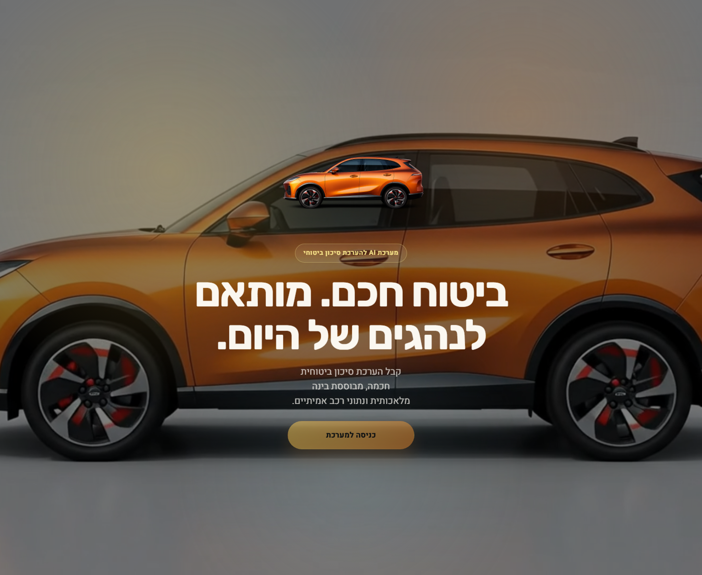
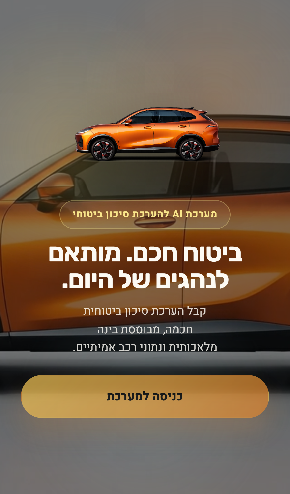
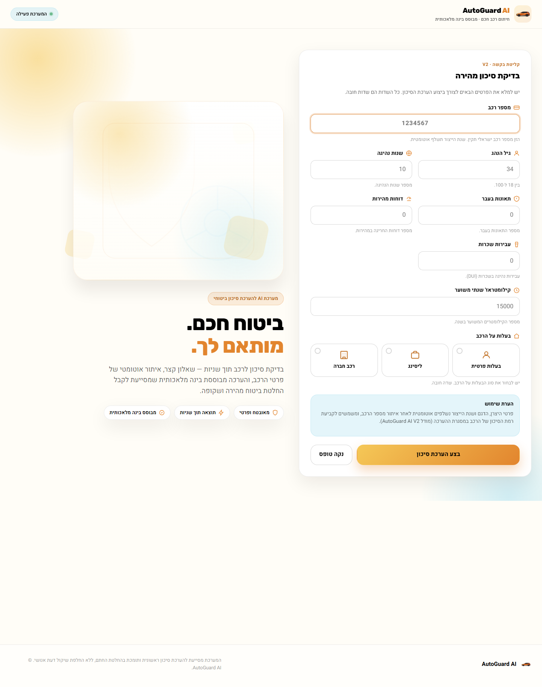

# Sprint 11.1 - Cinematic Landing Summary

## Scope

Sprint 11.1 replaced the initial entry experience for AutoGuard AI V2 with a
full-screen cinematic landing page while preserving the existing V2 dashboard
workflow and backend behavior.

No backend APIs, model artifacts, prediction logic, or V2 serving code were
modified.

## Design Decisions

- Added a full-screen landing layer that appears before the application shell.
- Integrated the supplied `orange-car-driving.mp4` as the landing background
  with autoplay, muted playback, looping, and `object-fit: cover`.
- Applied a dark overlay and subtle palette-driven glows to improve contrast
  without blurring the video.
- Kept the in-system dashboard background on the lighter abstract treatment
  after entry, per the final clarification, so the cinematic car treatment is
  limited to the landing experience only.
- Used the supplied SUV artwork as the refreshed brand mark across the landing,
  navbar, footer, touch icon, and favicon assets.
- Added a fade-and-slide handoff from landing to dashboard with a
  reduced-motion fallback that skips the long transition and pauses the video.

## Screenshots

### Landing - Desktop

### Landing - Mobile

### Dashboard After Entry

## Video Integration Details

- Served asset: `frontend/static/assets/orange-car-driving.mp4`
- HTML integration:
  - `<link rel="preload" as="video" ...>`
  - `<video autoplay muted loop playsinline preload="auto">`
- CSS integration:
  - fixed full-screen placement
  - `object-fit: cover`
  - dark overlay for readability
- Behavior:
  - no auto-redirect
  - user stays on the landing loop until clicking `כניסה למערכת`
  - dashboard becomes interactive only after the entry transition starts

## Logo Replacement Summary

Updated brand assets:

- `frontend/static/assets/logo-orange-suv.png`
- `frontend/static/assets/logo-180.png`
- `frontend/static/assets/logo-192.png`
- `frontend/static/assets/logo-512.png`
- `frontend/static/favicon.ico`

Updated UI surfaces:

- landing screen
- navbar
- footer
- empty-state/loading icon usage
- browser icon / touch icon

## Performance Notes

- Landing video is preloaded to reduce first-interaction delay.
- The application shell stays inert behind the landing until entry, avoiding
  accidental interaction before the handoff completes.
- Existing dashboard image usage was reduced and non-critical logo rendering
  remains lightweight.
- The landing uses fixed sizing and reserved media dimensions to avoid layout
  shift during load.

## Accessibility Review

- Primary entry CTA is keyboard accessible.
- Visible focus ring is preserved on the landing CTA and form controls.
- Reduced-motion users get a fallback that pauses the landing video and skips
  the long transition timing.
- The dashboard shell is marked `aria-hidden` and `inert` until the user
  enters, then focus is moved to the license-plate field.

## Validation

Executed checks:

- `python -m pytest tests/test_dashboard_flow.py -q`
- `python -m pytest tests/test_quick_predict.py -q`

Results:

- dashboard landing flow passed
- API failure handling passed
- missing ownership client-side validation passed
- V2 quick-predict suite remained unchanged and passed
